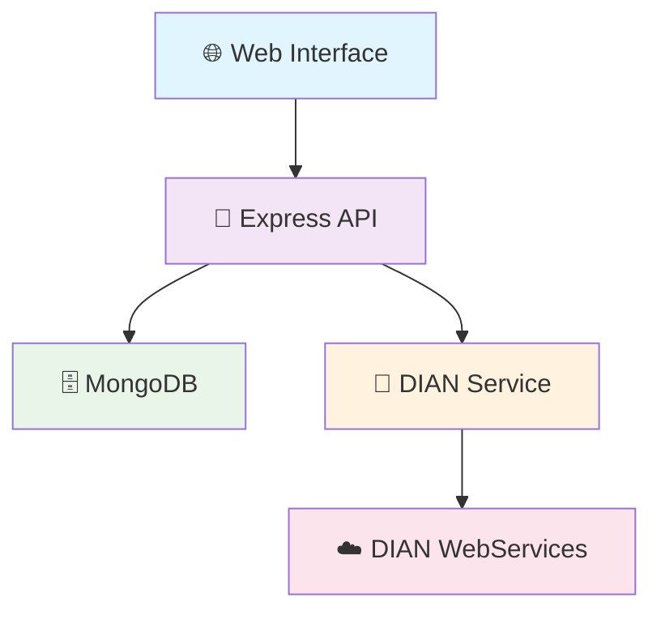

# 🧾 DIAN Electronic Invoicing System

<div align="center">


**🇨🇴 Complete electronic invoicing solution for Colombia**

*Connect your business with DIAN automatically and securely*

[🚀 Demo](#-quick-start) • [📖 Features](#-features) • [🛠️ Installation](#-installation) • [🤝 Contributing](#-contributing)

</div>

---

## 🎯 **What does this project do?**

Transform the tedious process of electronic invoicing in Colombia into a **smooth and automated experience**. Generate, sign, and send invoices to DIAN with **just one click**.

### ✨ **Key Features**

🔐 **UBL 2.1 Generation** - Full compliance with DIAN standards  
📊 **Real-time Dashboard** - Live statistics of your invoices  
🌐 **Complete REST API** - Integrate with any existing system  
⚡ **DIAN Integration** - Automatic sending and validation  
📱 **Responsive Design** - Works perfectly on mobile and desktop  
🛡️ **Enterprise Security** - JWT, encryption, and validations  

### 🎬 **Preview**

```
┌─────────────────────────────────────────────────────────────┐
│  📊 Dashboard                                               │
│  ┌─────────┐ ┌─────────┐ ┌─────────┐                       │
│  │ Total   │ │ Companies│ │ ✅ DIAN │                       │
│  │   247   │ │    12    │ │   198   │                       │
│  └─────────┘ └─────────┘ └─────────┘                       │
│                                                             │
│  🧾 Create Invoice → 📤 Send to DIAN → ✅ Approved         │
└─────────────────────────────────────────────────────────────┘
```

## 🚀 **Quick Start**

### Prerequisites
- 📦 Node.js 16+
- 🍃 MongoDB
- ⚡ 5 minutes of your time

### Installation
```bash
# Clone the repository
git clone https://github.com/your-username/dian-electronic-invoicing.git
cd dian-electronic-invoicing

# Install dependencies
npm install

# Set up environment
cp .env.example .env

# Start the application
npm run dev
```

### 🎉 That's it!
Open `http://localhost:3000` and start creating invoices!

## 🏗️ **Architecture**



## 📋 **API Endpoints**

<details>
<summary>🔍 View complete API documentation</summary>

### Companies
```http
GET    /api/companies           # List all companies
POST   /api/companies           # Create new company
GET    /api/companies/:id       # Get company by ID
```

### Invoices
```http
GET    /api/invoices                    # List all invoices
POST   /api/invoices                    # Create new invoice
GET    /api/invoices/:id                # Get invoice by ID
POST   /api/invoices/:id/send-to-dian   # Send to DIAN
```

</details>

## 🛡️ **DIAN Compliance**

✅ **UBL 2.1 Format** - Standard XML format  
✅ **CUFE Generation** - Unique invoice codes  
✅ **Mock DIAN Integration** - Ready for production  
✅ **Tax Calculations** - Automatic IVA calculation  

## 📊 **Project Structure**

```
📦 dian-electronic-invoicing
├── 📁 models/              # MongoDB models
├── 📁 routes/              # API routes
├── 📁 services/            # Business logic
├── 📁 public/              # Frontend files
├── 🔧 server.js            # Main server
└── 📋 package.json         # Dependencies
```

## 🤝 **Contributing**

Contributions are welcome! Here's how you can help:

1. 🍴 Fork the repository
2. 🌿 Create your feature branch: `git checkout -b feature/amazing-feature`
3. 💾 Commit your changes: `git commit -m 'Add amazing feature'`
4. 📤 Push to the branch: `git push origin feature/amazing-feature`
5. 🔄 Open a Pull Request

## 📄 **License**

This project is licensed under the MIT License - see the [LICENSE](LICENSE) file for details.

## 🙏 **Acknowledgments**

- 🏛️ **DIAN Colombia** - For technical documentation
- 🌐 **OASIS UBL** - For UBL 2.1 standard
- 👥 **Open Source Community** - For amazing libraries

---

<div align="center">

### 🌟 **Star this project if you found it helpful!** ⭐

**Made with ❤️ in Colombia 🇨🇴**

[⬆️ Back to top](#-dian-electronic-invoicing-system)

</div>